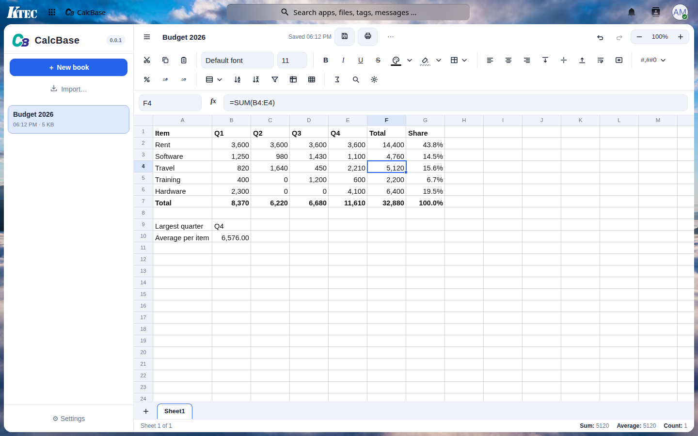
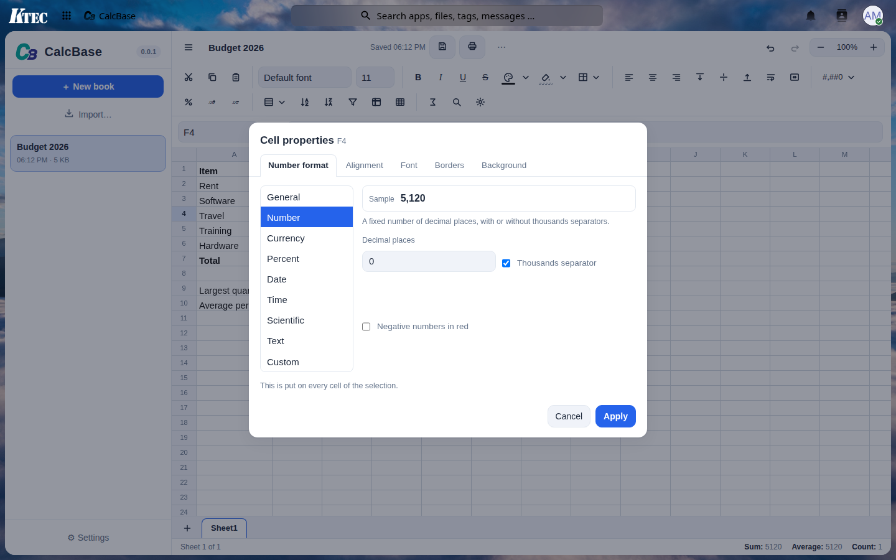
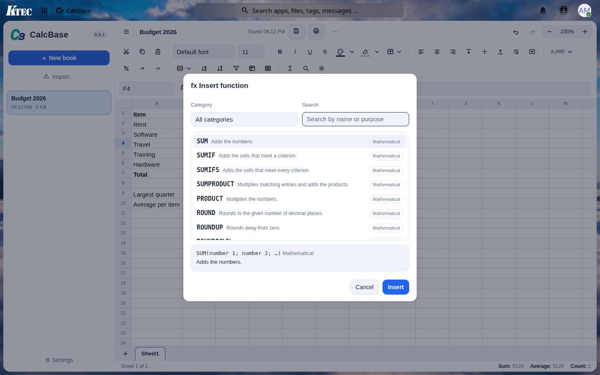
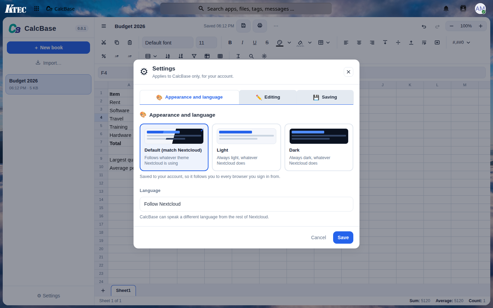

# CalcBase 📊

**A spreadsheet for Nextcloud whose workbooks are ordinary web pages.**
**Nextcloud 用の表計算です。ブックそのものが、ふつうの Web ページとして保存されます。**

> A personal project, written for my own use and shared in case it is useful to someone.
> Self-hosted; your data stays in your own Nextcloud.
> 自分用に作った個人プロジェクトで、どなたかの役に立てばと思い公開しています。
> セルフホストで、データはあなた自身の Nextcloud の中だけに保存されます。

[English ↓](#english) · [日本語 ↓](#japanese)

---

<a id="english"></a>

## English

### What it is

CalcBase saves every workbook as a single self-contained `.html` file in your own
Files. Each sheet is an HTML table holding what every cell shows, with the formula,
the exact value and the number format kept beside it in the cell's attributes. The
file opens and reads correctly in any browser, on any device, without CalcBase —
and CalcBase opens it again as a live spreadsheet.

It is the spreadsheet of the same series as [EditBase](https://github.com/ktec-nc-apps/EditBase),
the word processor that writes plain HTML, and it is built the same way: HTML5 and
CSS first, JavaScript only for what they cannot do (here: calculating).

### Features

- **Formulas as LibreOffice Calc writes them** — `=SUM(B2:B5)`, `=VLOOKUP(A2;Prices.A:B;2;0)`,
  `=IF(C2>0,"yes","no")`; `,` or `;` between arguments, references to other sheets as
  `Sheet2.A1` or `Sheet2!A1`, `$` for absolute references, whole columns and rows.
- **143 functions** — maths, statistics, logic, text, lookup, date and time (Japanese
  era dates included), information and finance. Where LibreOffice Calc and Excel
  differ, Calc is followed; the engine is checked against LibreOffice itself on some
  1,250 formulas.
- **A grid that stays fast** — only what is on screen is drawn, so a sheet of 100,000
  rows scrolls smoothly; a change recalculates only what depends on it.
- Working as in Calc: typing, Enter and Tab, editing in the cell or the formula bar,
  pointing at cells while writing a formula, F4 for `$`, selection with the mouse and
  the keyboard, copy and paste (to and from LibreOffice, Excel and Google Sheets),
  the fill handle (series and formulas), insert and delete rows and columns (formulas
  follow), undo and redo, find and replace.
- Number formats (number, currency, percent, date, time, text, your own codes), fonts,
  bold, italic, underline, colours, fill, borders, alignment, wrapping, merged cells,
  column widths and row heights, freeze panes, sort and an autofilter.
- Several sheets in a book, renamed, moved and copied from their tabs.
- **Import** CSV/TSV (UTF-8 or Shift_JIS), ODS and XLSX; **export** CSV, ODS and XLSX,
  formulas included.
- Versions kept beside the workbook (`Book.#01.html` …), autosave, and printing the
  sheet or the selection with a page setup.
- An **AI assistant**, through the [AI-Hub](https://github.com/ktec-nc-apps/AI-Hub) app:
  a chat beside the sheet that knows spreadsheets, explains and writes formulas, and
  changes cells when asked (every change undoable). Off until the administrator turns
  it on, for everyone or for chosen groups.
- Light and dark themes, Japanese and English, and a layout for phones.

### The file it writes

```html
<section class="cb-sheet" data-name="Sheet1">
  <table>
    <tr><td data-t="s">Total</td>
        <td data-f="=SUM(B2:B5)" data-t="n" data-v="1234.5" data-fmt="#,##0.00"
            style="font-weight:700">1,234.50</td></tr>
  </table>
</section>
```

### What it does not do (yet)

Charts, pivot tables, conditional formatting, data validation, array formulas
(Ctrl+Shift+Enter), macros, and editing the same workbook by several people at once.

### Requirements

- Nextcloud 30 – 35
- PHP 8.1 or later
- For the AI assistant: the [AI-Hub](https://github.com/ktec-nc-apps/AI-Hub) app

### Installation

Copy the app into your Nextcloud's `apps` folder as `calcbase` and enable it:

```sh
sudo -u www-data php occ app:enable calcbase
```

### Status

0.0.1 — the first shape. Not yet in the App Store.

<a id="japanese"></a>

## 日本語

### 概要

CalcBase は、すべてのブックを自分の Files の中の 1 枚の独立した `.html` ファイルとして保存します。
シートはそれぞれ HTML の表で、各セルには表示される文字と、その横に式・正確な値・表示形式が
セルの属性として入ります。CalcBase が無くても、どの端末のどのブラウザでも表として正しく開けて、
CalcBase で開けば計算する表計算に戻ります。

素の HTML を書き出すワードプロセッサ [EditBase](https://github.com/ktec-nc-apps/EditBase) と
同じシリーズの表計算で、作り方も同じです。HTML5 と CSS が先、JavaScript はそれで無理なこと
（ここでは計算）にだけ使います。

### 主な機能

- **LibreOffice Calc と同じ書き方の式** ― `=SUM(B2:B5)`、`=VLOOKUP(A2;価格.A:B;2;0)`、
  `=IF(C2>0,"はい","いいえ")`。引数の区切りは `,` と `;` のどちらでも、別のシートは
  `Sheet2.A1` でも `Sheet2!A1` でも、`$` の絶対参照、列全体・行全体も書けます。
- **関数 143 個** ― 数学・統計・論理・文字列・検索/行列・日付/時刻（和暦を含む）・情報・財務。
  LibreOffice Calc と Excel で違う所は Calc に合わせ、約 1,250 の式で LibreOffice 本体と
  結果を突き合わせて確かめています。
- **速いままの格子** ― 画面に見えている所だけを描くので 10 万行のシートも滑らかに動き、
  変更はそれに関わるセルだけを計算し直します。
- Calc と同じ操作：入力、Enter と Tab、セル内と数式バーでの編集、式の入力中にセルを指して参照を入れる、
  F4 で `$`、マウスとキーボードでの選択、コピーと貼り付け（LibreOffice・Excel・Google スプレッドシートとの間でも）、
  フィルハンドル（連続データと式）、行と列の挿入と削除（式が追随）、元に戻す/やり直し、検索と置換。
- 表示形式（数値・通貨・パーセント・日付・時刻・文字列・自分で書く書式）、フォント、太字・斜体・下線、
  文字色・塗りつぶし・罫線・配置・折り返し、セルの結合、列の幅と行の高さ、ウィンドウ枠の固定、並べ替えとオートフィルター。
- 1 つのブックに複数のシート。タブから名前の変更・移動・複製ができます。
- **取り込み**：CSV/TSV（UTF-8 と Shift_JIS）・ODS・XLSX。**書き出し**：CSV・ODS・XLSX（式も含めて）。
- ブックの横に残る版（`ブック.#01.html` …）、自動保存、シートや選択範囲の用紙設定付きの印刷。
- [AI-Hub](https://github.com/ktec-nc-apps/AI-Hub) アプリを通した **AI アシスタント**。表計算を知っているチャットが
  シートの横に出て、式を説明したり書いたりし、頼めばセルを変更します（すべて元に戻せます）。
  管理者が有効にするまでは使えず、全員か選んだグループにだけ許可できます。
- ライトとダークのテーマ、日本語と英語、スマートフォン向けの画面。

### 書き出す HTML

```html
<section class="cb-sheet" data-name="Sheet1">
  <table>
    <tr><td data-t="s">合計</td>
        <td data-f="=SUM(B2:B5)" data-t="n" data-v="1234.5" data-fmt="#,##0.00"
            style="font-weight:700">1,234.50</td></tr>
  </table>
</section>
```

### まだできないこと

グラフ、ピボットテーブル、条件付き書式、入力規則、配列数式（Ctrl+Shift+Enter）、マクロ、
複数人での同時編集。

### 動作要件

- Nextcloud 30 〜 35
- PHP 8.1 以上
- AI アシスタントを使う場合：[AI-Hub](https://github.com/ktec-nc-apps/AI-Hub) アプリ

### 導入

アプリを Nextcloud の `apps` フォルダーに `calcbase` として置き、有効にします：

```sh
sudo -u www-data php occ app:enable calcbase
```

### 現在の状態

0.0.1 ― 最初の形です。App Store にはまだ出していません。

## Screenshots

| | |
|---|---|
|  |  |
| A sheet with formulas / 式の入ったシート | Cell properties / セルのプロパティ |
|  |  |
| Insert function / 関数の挿入 | Settings / 設定 |

## Licence

[AGPL-3.0-or-later](LICENSE) · © KTEC
